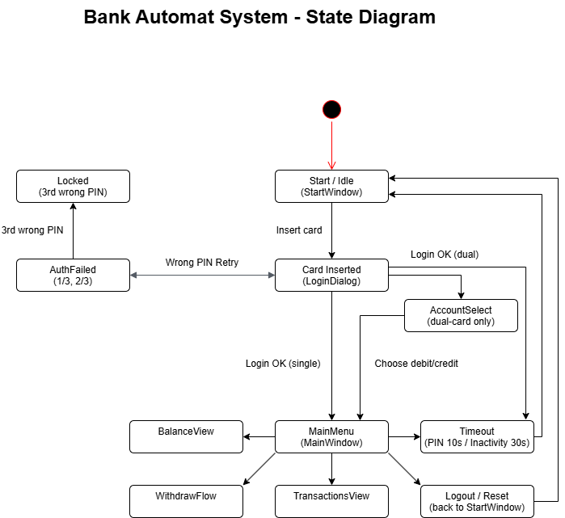

# Technical Specification – Bank Automat System

## 1. System Overview

The Bank Automat System is a desktop-based ATM simulation consisting of:

- **Qt 6 Desktop Application (C++ / Qt Widgets)**
- **Node.js + Express REST API**
- **MySQL Database**

The system allows users to:
- Log in using card number and PIN
- View account balance
- Withdraw fixed amounts
- View last 10 transactions

## 2. Architecture

### High-Level Architecture

Qt Client → HTTP (JSON) → Express API → MySQL Database

### Components

#### Qt Application
- UI implemented with Qt Widgets
- Uses QNetworkAccessManager for REST communication
- Session state: currentAccountId

#### Backend API
- Node.js + Express
- MySQL connection pool (mysql2)
- bcrypt for PIN hashing
- REST endpoints

#### Database
- Relational schema
- Primary/foreign keys
- PIN stored hashed

## 3. Use Cases

### UC1 – Login
User enters card number and PIN.
System validates PIN (bcrypt).
If valid → access granted.
If invalid → error shown.

### UC2 – View Balance
User requests account balance.
System returns current balance.

### UC3 – Withdraw Money
User selects amount (20, 40, 50, 100).
System checks sufficient funds.
Balance updated.
Transaction stored.

### UC4 – View Transactions
User views last 10 transactions.
System returns ordered list (DESC by date).

## 4. Data Model

### Tables

#### customers
- id (PK)
- first_name
- last_name
- address
- created_at

#### accounts
- id (PK)
- customer_id (FK)
- account_type (debit/credit)
- balance
- credit_limit
- is_locked
- created_at

#### cards
- id (PK)
- card_number (UNIQUE)
- customer_id (FK)
- pin_hash
- status (active/locked)
- created_at

#### transactions
- id (PK)
- account_id (FK)
- amount
- tx_type
- created_at

#### card_accounts
- card_id (FK)
- account_id (FK)
- role (debit/credit)
- PRIMARY KEY (card_id, account_id)

## 5. Security

- PIN codes stored hashed (bcrypt)
- No plaintext PIN storage
- Input validation in API layer
- Environment variables for DB credentials
- HTTP status codes used for error handling

## 6. API Endpoints

POST /auth/login  
GET /accounts/:id/balance  
POST /accounts/:id/withdraw  
GET /accounts/:id/transactions?limit=10  

CRUD endpoints for all tables under /crud/...

## 7. Non-Functional Requirements

- Responsive UI
- Clear error handling
- Atomic database transactions
- Clean code structure
- Git version control

## 8. Future Improvements

- Card lock after 3 failed PIN attempts
- Inactivity timeout
- Credit account logic
- Docker deployment
- Automated testing

## 9. Reverse Proxy Logging (Nginx)

Nginx access and error logging was enabled to support debugging and operational visibility.

- Access log: `logs/access.log`
- Error log: `logs/error.log`

**Example access log entry (GET /api/health):**
```text
127.0.0.1 - - [25/Feb/2026:12:34:56 +0200] "GET /api/health HTTP/1.1" 200 27 "-" "PostmanRuntime/7.36.0" rt=0.012 uct=0.001 urt=0.010 uaddr=127.0.0.1:3000 ustatus=200
```
Example error log entry (backend down, 502):
```text
[error] ... connect() failed (...) while connecting to upstream, client: 127.0.0.1, server: localhost, request: "GET /api/health HTTP/1.1", upstream: "http://127.0.0.1:3000/health", host: "localhost"
```

##  10. Demo: API Behind Reverse Proxy (Nginx)

### Objective

Demonstrate that the backend API runs behind a reverse proxy (Nginx) and that all routing works correctly through the proxy entrypoint.

### Architecture Overview (Demo Explanation)

In development, the system uses the following architecture:

Client (Browser / Postman / Qt)
→ http://localhost (Nginx reverse proxy)
→ http://localhost:3000 (Node.js / Express backend)
→ MySQL database

The reverse proxy:

- Serves a static landing page at `/`
- Forwards `/api/*` to the backend
- Strips the `/api` prefix before forwarding
- Adds standard proxy headers (X-Forwarded-For, X-Forwarded-Proto)
- Logs access and error events

### Step 1 – Show Reverse Proxy Entry Point

Open browser:

http://localhost

Show that:
- Nginx is running
- Static landing page is served
- Backend is NOT directly exposed on port 80

### Step 2 – Show API Through Proxy

Call:

GET http://localhost/api/health

Explain:
- Request goes to Nginx
- Nginx forwards to backend (localhost:3000)
- Backend returns JSON response
- Response is returned through proxy

Expected result:
200 OK

### Step 3 – Authentication Test

POST http://localhost/api/auth/login

Body:
{
  "cardNumber": "...",
  "pin": "...."
}

Show:
- Successful login returns accountId
- Incorrect PIN returns 401
- Card status is validated

### Step 4 – Account Operations

Demonstrate:

GET /api/accounts/{id}/balance  
POST /api/accounts/{id}/withdraw  
GET /api/accounts/{id}/transactions?limit=10  

Explain:
- All routes function through proxy
- No backend route changes were required
- Business logic is handled by backend
- Proxy only handles routing and infrastructure

### Step 5 – Failure Scenario (Backend Down)

Stop backend.

Call:
GET /api/health

Show:
- Nginx returns 502 Bad Gateway
- Error is logged in error.log
- Proxy fails safely

Restart backend and show recovery.

### Step 6 – Logging Demonstration

Open access.log and show:

- Client IP
- Request path
- HTTP status
- Upstream address
- Upstream response time

Explain:
- Logging enables debugging and monitoring
- Proxy and backend responsibilities are separated

### Conclusion

The API runs successfully behind a reverse proxy.

✔ Routing works via /api/*  
✔ Backend is isolated behind Nginx  
✔ Errors are handled predictably  
✔ Logging is enabled  
✔ Architecture reflects a production-style deployment model  

The implementation was tested using Postman and verified through proxy logs.

## 11. PIN Code 10-Second Timeout

### Overview

A 10-second inactivity timeout has been implemented in the `LoginDialog`.

If the user does not enter a PIN or otherwise interact with the login interface within 10 seconds, the system will:

1. Clear the PIN field and any error messages  
2. Close the `LoginDialog`  
3. Return to the `StartWindow`  

The timeout behaves like a real ATM: **any user activity inside the LoginDialog resets the 10-second timer.**

## 12. User Activity (Timeout Reset)

The inactivity timer is reset by any of the following actions:

- Typing in the PIN field
- Typing in the card number field
- Clicking the Login button
- Moving the mouse inside the dialog
- Clicking anywhere in the dialog
- Pressing any key
- Changing focus between input fields

If a login request is in progress (waiting for backend response), the timeout is temporarily stopped to prevent the dialog from closing during authentication.

### Testing Instructions

### Basic Timeout Test

1. Open the `LoginDialog` from the `StartWindow`.
2. Do not interact with the UI.
3. Wait 10 seconds.

**Expected result:**  
The `LoginDialog` closes automatically and the application returns to the `StartWindow`.

### Timeout Reset Test

1. Open the `LoginDialog`.
2. Wait approximately 8–9 seconds.
3. Move the mouse or type something in the PIN field.

**Expected result:**  
The timer resets and the dialog does not close at the original 10-second mark.

### Login-In-Progress Test

1. Enter card number and PIN.
2. Click **Login**.
3. (If backend response takes time)

**Expected result:**  
The timeout does not trigger while authentication is in progress.

### Demo Presentation (For Instructor)

During the demo, the following will be shown:

1. Open login → wait 10 seconds → automatic return to StartWindow.
2. Open login → move mouse → timeout does not trigger.
3. Press Login → no timeout during authentication process.

### Technical Implementation Summary

- `QTimer` (10,000 ms, singleShot mode)
- `eventFilter` resets the timer on all user activity
- `m_loginInProgress` prevents timeout during authentication
- On timeout:
  - UI fields are cleared
  - Login button state is restored
  - Dialog closes via `reject()`

## 13. Advanced Functionalities

### Persistent Card Lock (Database-Level Security)

#### Overview

The system implements a **persistent card lock mechanism**.

If a user enters an incorrect PIN **three consecutive times**, the card is permanently locked in the database.

The lock state persists even if the backend server is restarted.

#### Database Behavior

The `cards` table includes the following fields:

- `failed_pin_attempts INT NOT NULL DEFAULT 0`
- `status ENUM('active','locked')`
- `locked_at DATETIME NULL`

#### Locking Logic

1. On each failed login attempt:
   - `failed_pin_attempts` is incremented.
2. When `failed_pin_attempts >= 3`:
   - `status` is set to `'locked'`
   - `locked_at` is set to the current timestamp.
3. On successful login:
   - `failed_pin_attempts` is reset to `0`.

If a locked card attempts login:

```json
HTTP 403
{
  "error": "Card locked"
}
```

#### Persistence

Because the lock status is stored in MySQL:

- Restarting the backend does NOT unlock the card.
- The card must be manually unlocked in the database (admin/dev use).

### 30-Second Global Inactivity Timeout (ATM Security)

#### Overview

A 30-second inactivity timeout has been implemented in the main application window (`MainWindow`).

If no user interaction occurs within 30 seconds:

1. The session is terminated
2. `MainWindow` is closed
3. The application returns to `StartWindow`

This simulates real ATM behavior and prevents unauthorized access.

#### How Inactivity Is Measured

The application installs a global `eventFilter` on the Qt application.

The timer resets on:

- Mouse movement
- Mouse clicks
- Keyboard input
- Focus changes
- Touch events

Implementation details:

- `QTimer` (30,000 ms, singleShot)
- `qApp->installEventFilter(this)`
- `resetIdleTimer()` called on user activity
- On timeout → `emit idleTimeout()`
- `StartWindow` listens and performs safe reset

#### Behavior on Timeout

When the timer expires:

- `StartWindow` is shown fullscreen
- `MainWindow` is safely closed
- Session state (accountId) is cleared

### Transaction Pagination (10 per Page)

#### Overview

Transactions are retrieved using **cursor-based pagination**.

- Default order: newest → oldest
- Page size: 10 transactions
- Supports forward (older) and backward (newer) navigation

#### API Endpoint

```
GET /accounts/:id/transactions
```

#### Query Parameters

| Parameter | Description |
|-----------|------------|
| `limit`   | Number of transactions (default 10) |
| `before`  | Cursor for older transactions |
| `after`   | Cursor for newer transactions |

#### Cursor Format

```
<epochMilliseconds>|<transactionId>
```

Example:

```
1772149218000|7
```

Using epoch time ensures correct ordering even if multiple transactions share the same timestamp.

#### Example cURL – First Page (Newest)

```bash
curl "http://localhost:3000/accounts/1/transactions?limit=10"
```

Response:

```json
{
  "items": [...],
  "nextCursor": "1772149218000|7",
  "prevCursor": null
}
```

#### Example cURL – Next Page (Older Transactions)

```bash
curl "http://localhost:3000/accounts/1/transactions?limit=10&before=1772149218000%7C7"
```

#### Example cURL – Previous Page (Newer Transactions)

```bash
curl "http://localhost:3000/accounts/1/transactions?limit=10&after=1772149218000%7C7"
```

#### Qt UI Behavior

In the Transactions tab:

- **Next** → fetches older transactions (`before=nextCursor`)
- **Previous** → fetches newer transactions (`after=prevCursor`)
- Buttons automatically disable:
  - Next is disabled on the last page
  - Previous is disabled on the newest page
- Row numbers are shown as continuous numbering:
  - Page 1: 1–10
  - Page 2: 11–20
  - etc.

After a withdrawal:

- The system refreshes to the first page
- The newest transaction becomes immediately visible

### Testing Instructions

#### Persistent Card Lock

1. Enter incorrect PIN three times.
2. Observe HTTP 403 response.
3. Restart backend.
4. Attempt login with correct PIN.

Expected result:  
Card remains locked.

#### 30-Second Inactivity

1. Login successfully.
2. Do not interact with the application.
3. Wait 30 seconds.

Expected result:  
Application returns to `StartWindow` automatically.

#### Transaction Pagination

1. Login.
2. Open Transactions tab.
3. Press **Next** → older transactions appear.
4. Press **Previous** → return to newer transactions.
5. Continue pressing Next until last page.

Expected result:  
Next button becomes disabled on final page.

6. Perform a withdrawal.
7. Transactions reset to first page.
8. New transaction appears at top.

## 14. Dual Cards (Debit + Credit on the Same Card)

### Overview

The system supports **dual cards**, meaning a single physical card can be linked to:

- one **debit account**
- one **credit account**

This allows the user to choose which account to use after successful login.

### Data Model

The relationship between cards and accounts is implemented using a junction table:
```
cards 1 --- N card_accounts N --- 1 accounts
```

#### card_accounts table

| Column      | Type    | Description |
|------------|---------|-------------|
| card_id     | INT (FK) | References `cards.id` |
| account_id  | INT (FK) | References `accounts.id` |
| role        | ENUM('debit','credit') | Defines account type for the card |
| created_at  | DATETIME | Link creation timestamp |

#### Constraints

- `PRIMARY KEY (card_id, account_id)`
- `UNIQUE (card_id, role)`  
  → prevents assigning two debit or two credit accounts to the same card

These constraints ensure:

- A card can have **maximum two links**
- Only one `debit` and one `credit` role per card
- Duplicate links are prevented at database level

### Backend Behavior

The endpoint:
```
POST /crud/card-accounts
```
- Accepts: `card_id`, `account_id`, `role`
- Returns:
  - `201` on success
  - `409` if:
    - the same account is already linked to the card
    - the same role (debit/credit) is already assigned

The database enforces role uniqueness, and the backend converts duplicate key errors into HTTP 409 responses.

### Login Flow Impact

During login:

- If the card is linked to **one account** → system proceeds automatically.
- If the card is linked to **two accounts (debit + credit)** → user must select which account to use.

This design cleanly separates:
- Card identity (authentication)
- Account selection (transaction context)

## 15. State Diagram



The diagram describes the main UI states and transitions for login, account selection (dual cards), main menu, balance, withdrawals, transactions, logout/reset, and timeouts/lock behavior.